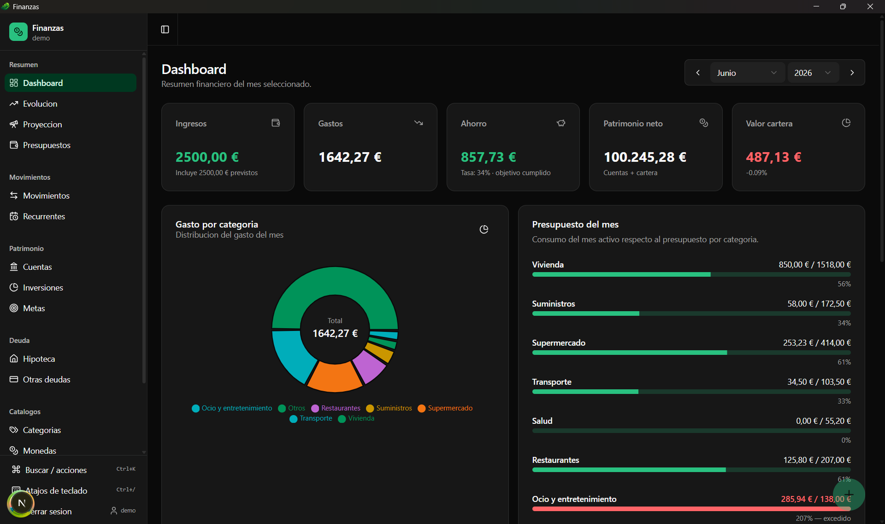
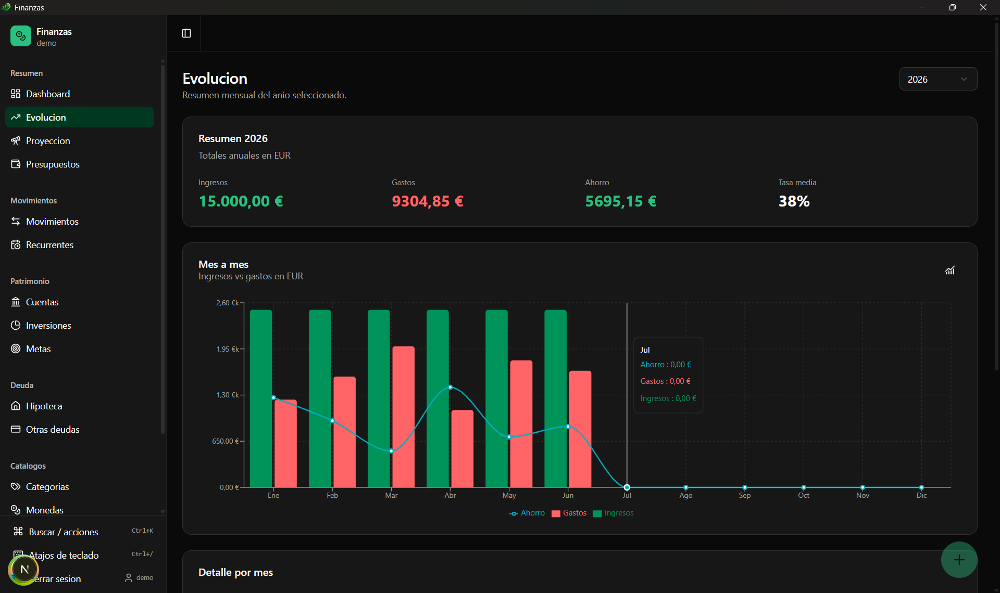
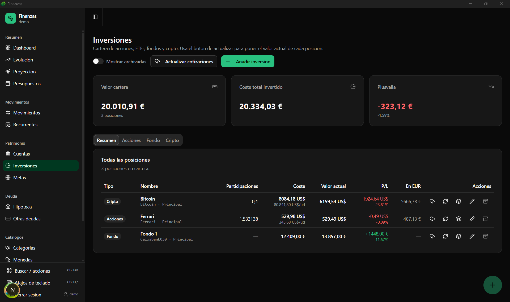

<div align="center">


# Finanzas

### Tu vida financiera, en tu escritorio y en tu equipo.

App de finanzas personales **local-first**: multiplataforma, multimoneda y multiusuario.
Sin nube, sin servidor, sin cuentas de terceros — **tus datos viven en tu máquina**.

<br/>


</div>

---

## ✨ En un vistazo

- 🖥️ **De escritorio y privada** — corre nativa con Tauri; los datos en **SQLite local**, nunca salen de tu equipo.
- 📈 **Cartera con cotizaciones EN VIVO** — actualiza acciones, ETFs y cripto por *ticker*, y **fondos por participaciones × valor liquidativo**, desde Yahoo Finance. Resolver **ISIN → símbolo** incluido.
- 💱 **Tipos de cambio automáticos** — divisas actualizadas a diario con las referencias del **BCE** (Frankfurter), o a mano.
- 🎯 **Objetivos y presupuestos con vigencia** — define metas y presupuestos que **cambian con el tiempo** (sube el sueldo, cambia el alquiler) sin reescribir el pasado.
- 🧮 **Saldos calculados, no tecleados** — el saldo de cada cuenta se deriva de los movimientos; cuadra solo.
- 👥 **Multiusuario con PIN** — una base de datos por usuario, aislamiento físico, login PBKDF2.
- 🌗 **Tema claro/oscuro**, multimoneda, papelera con *undo*, backup en JSON, atajos y paleta de comandos.

---

## 📸 Capturas

<div align="center">



<br/><br/>

| Evolución | Inversiones |
|:---:|:---:|
|  |  |

</div>

---

## 🧭 Funcionalidades

### 📊 Resumen y análisis
- **Dashboard** — KPIs del mes (ingresos, gastos, ahorro y tasa, patrimonio neto, valor de cartera), gasto por categoría, progreso de presupuesto, **ahorro acumulado vs objetivo** y últimos movimientos.
- **Evolución** — ingresos vs gastos mes a mes, con varios estilos (líneas, barras, áreas, combo). Modo **por año** o **desde tu objetivo de ahorro** (cruzando años), con **marcas** en los meses donde cambia un objetivo o presupuesto.
- **Proyección** — patrimonio neto futuro según tu tasa de ahorro media, con las **metas** superpuestas y fecha estimada de cumplimiento.
- **Presupuestos** — consumo del mes y **acumulado**, con presupuestos que pueden **cambiar por fecha** y arrancar desde tu objetivo.

### 💸 Movimientos
- **Gastos, ingresos, transferencias, ajustes, cuotas, intereses** y **devoluciones** (reembolsos que **restan del gasto neto** de su categoría, sin inflar ingresos).
- Filtros por periodo y tipo. El importe siempre es positivo; el **tipo** y las cuentas origen/destino dan el signo.
- **Recurrentes** — reglas que generan movimientos solas cada mes al arrancar (salario, alquiler, cuotas, intereses…). Idempotentes.

### 🏦 Patrimonio
- **Cuentas** — corriente, ahorro, broker, efectivo, crédito. **Saldo calculado** desde los movimientos, con conciliación y cuenta por defecto.
- **Inversiones** — acciones, ETF, fondos, cripto, bonos, planes de pensiones, inmuebles, robo-advisor, cuenta remunerada… con P/L, aportaciones **puntuales y periódicas**, retiradas a una cuenta real y **archivado** de posiciones cerradas.
  - 🔄 **Cotización automática**: precio por *ticker* (Yahoo) para lo cotizado; **fondos por unidades × VL**; conversión a la moneda del activo; **TAE automática** para cuentas remuneradas.
- **Metas** — objetivos de ahorro (importe + fecha) con progreso automático si vinculas una cuenta, y meta de **tasa de ahorro** (% y/o €/mes) con cumplimiento de los últimos 12 meses. El objetivo es **por tramos** (efectivo desde un mes, con cambios datados).

### 🏠 Deuda
- **Hipoteca** — cuota (PMT) y tabla de amortización; puede integrarse en el dashboard y generar su movimiento recurrente.
- **Otras deudas** — préstamos, coche, tarjetas, personales.

### ⚙️ Catálogos y sistema
- **Categorías** (presupuesto por tramos), **Monedas** (tipo de cambio manual o automático).
- **Ajustes** — moneda local/vista, objetivo de ahorro, hipoteca, patrimonio inicial, **backup** (exportar/importar JSON), cambio de PIN.
- **Papelera** — restauración de elementos borrados (*soft-delete*).

---

## 🔒 Privacidad y multiusuario

- **Una base de datos por usuario** (`user_<id>.db`): el aislamiento de datos es **físico**, no por columnas. Un registro aparte (`_users.db`) guarda los usuarios.
- **Login por PIN** (4–8 dígitos) con **PBKDF2-SHA256**. Usuario `admin` para gestionar usuarios y autorregistro desde el login.
- Opción **"mantener sesión iniciada"** (recuerda el usuario, no el PIN).
- **Todo local**: la única conexión a internet es opcional, para cotizaciones y tipos de cambio (se envían *tickers*/ISIN, nunca tus importes).

---

## 🧱 Stack técnico

| Capa | Tecnología |
|---|---|
| Shell de escritorio | **Tauri 2** (Rust) + WebView del sistema |
| UI | **Next.js 16** (App Router, export estático) + **React 19** |
| Lenguaje | **TypeScript** (estricto) |
| Base de datos | **SQLite** vía `@tauri-apps/plugin-sql` |
| ORM | **Drizzle ORM** (+ driver proxy a Tauri SQL) |
| Estado de servidor | **TanStack Query** |
| Componentes | **shadcn/ui** (Radix UI) + **Tailwind CSS 4** |
| Gráficos | **Recharts** |
| Formularios | **react-hook-form** + **Zod** |
| Red (cotizaciones/FX) | **@tauri-apps/plugin-http** (Yahoo Finance · BCE/Frankfurter) |
| Iconos / toasts | **lucide-react** / **sonner** |
| Tests | **Vitest** (capa de dominio) |

---

## 🏗️ Arquitectura, en una frase por idea

- **Local-first**: sin servidor ni nube; el WebView habla con SQLite a través de un *proxy-driver* a Drizzle.
- **Dominio puro y testeado**: el cálculo (moneda, inversiones, hipoteca, agregaciones, metas, tramos, recurrentes) vive en `lib/domain`, sin IO, cubierto por Vitest.
- **Repositorios + servicios**: cada tabla tiene su repositorio; los servicios orquestan flujos (recurrentes, aportaciones, backup, sincronizaciones).
- **Saldos derivados**: el saldo de una cuenta no se guarda, se calcula desde los movimientos.
- **Migraciones versionadas**: SQL en `drizzle/NNNN_*.sql`, embebidas en el binario y aplicadas una sola vez (runner idempotente).
- **Valores con vigencia (*tramos*)**: objetivos y presupuestos son líneas temporales; para cada mes se resuelve el valor vigente.

Más detalle en **[ARQUITECTURA.md](ARQUITECTURA.md)**.

---

## 🚀 Puesta en marcha

**Requisitos**: Node.js 20+, Rust stable; en Windows, *Visual Studio Build Tools 2022* con "Desktop development with C++" y WebView2 (ya viene en Windows 11).

```bash
npm install
npm run tauri:dev      # app de escritorio con hot reload
```

La primera vez se crean la base de datos, las migraciones, el *seed* (monedas y
categorías) y el usuario `admin` (PIN inicial `0000`, que se cambia al entrar).

---

## 🛠️ Comandos

| Comando | Qué hace |
|---|---|
| `npm run tauri:dev` | App de escritorio completa con hot reload |
| `npm run dev` | Solo frontend Next en `:3000` (sin Tauri) |
| `npm run build` | Genera el frontend estático en `/out` |
| `npm run tauri:build` | Genera el ejecutable nativo (`.exe`/`.msi`/…) |
| `npm run typecheck` | Verifica tipos sin compilar |
| `npm test` | Tests de dominio (Vitest) |
| `npm run db:generate` | Genera una migración SQL desde cambios en `schema.ts` |
| `npm run db:studio` | Abre Drizzle Studio (UI web para la BD) |

---

## 📂 Estructura

```
.
├── src/
│   ├── app/                 # Páginas (App Router): dashboard, movimientos, cuentas,
│   │                        #   inversiones, metas, presupuestos, evolucion, proyeccion,
│   │                        #   hipoteca, deudas, categorias, monedas, papelera, ajustes
│   ├── components/          # ui/ (shadcn) · auth/ · forms/ · charts/ · dashboard/ · ...
│   ├── contexts/            # AuthProvider · DatabaseProvider · GlobalThemeProvider
│   ├── hooks/               # Hooks de datos (TanStack Query) y utilidades
│   └── lib/
│       ├── auth/            # Registro de usuarios + hashing de PIN
│       ├── db/              # schema · client · proxy-driver · migrate · seed
│       ├── domain/          # Lógica pura (testeada): moneda, inversiones, tramos, ...
│       ├── repositories/    # Acceso a datos por tabla (Drizzle)
│       ├── services/        # Orquestación: recurrentes, aportaciones, cotizaciones, FX, backup
│       ├── schemas/         # Validación de formularios (Zod)
│       └── utils/           # Fechas, cn, ...
├── drizzle/                 # Migraciones SQL versionadas (0000_init … )
├── src-tauri/               # Proyecto Tauri (Rust) + tauri.conf.json + iconos
├── tests/                   # Tests de dominio (Vitest)
├── ARQUITECTURA.md          # Decisiones de arquitectura en detalle
└── README.md
```

---

## 💾 Datos, migraciones y backup

- Las migraciones viven en `drizzle/NNNN_*.sql`, se importan con `?raw` y se registran en `src/lib/db/migrate.ts`. El runner es **idempotente**.
- Para cambiar el esquema: editar `src/lib/db/schema.ts`, generar/escribir la migración y registrarla en `migrate.ts`.
- Los ficheros `.db` viven en el *AppData* del sistema (`personal.finanzas.app/`): `_users.db` + un `user_<id>.db` por usuario.
- **Backup**: Ajustes → Exportar (JSON versionado) o copia de los `.db`. Haz backup **antes de actualizar** (las migraciones se aplican al arrancar).

---

## 🗺️ Roadmap (ideas)

- Cobertura de **valor liquidativo de fondos no cotizados** por ISIN.
- Gráficos de evolución por inversión.
- Más automatizaciones de recurrentes y conciliación.

---

<div align="center">

Proyecto personal de **Pedro Uribe Chavert** · construido con Tauri + Next.js · 100% local.

</div>
